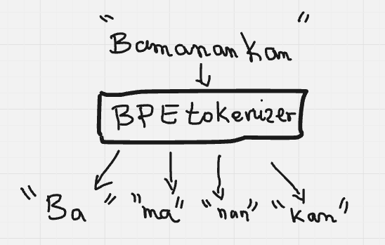

# 🐘 Bambara BPE Tokenizer

> A clean, research-grade **Byte Pair Encoding (BPE)** tokenizer built from scratch for the **Bambara** language.  
> Designed for linguists, NLP researchers, and developers working on Mande language processing.  
> Fully Linux-friendly and ready to run locally or in Google Colab.

---

## 🧩 Overview

The **Bambara BPE Tokenizer** is a lightweight implementation of the Byte Pair Encoding algorithm.  
It allows you to:
- Train subword tokenization models on Bambara text
- Handle Bambara diacritics (`ɛ`, `ɔ`, `ŋ`, `ɲ`)
- Encode and decode text into consistent subword units
- Use it as a standalone module or integrate into a larger NLP pipeline

---

## 🧠 Conceptual Illustration

Below is a simple visual explanation of how the tokenizer works:

<p align="center">
  
</p>

> Example:  
> `"Bamanankan"` → `"Ba"` `"ma"` `"nan"` `"kan"`

This shows how the tokenizer learns to break a Bambara word into subword components —  
a key step for efficient NLP modeling on low-resource languages.

---

## 📁 Project Structure

bambara-bpe-tokenizer/
├── README.md # Project documentation
├── requirements.txt # Dependencies list
├── LICENSE # MIT License
├── data/ # Example corpus files
│ └── sample_corpus.txt
├── bambara_bpe_tokenizer/ # Core Python package
│ ├── init.py
│ └── tokenizer.py
├── examples/ # Demos and notebooks
│ └── demo_colab.ipynb
├── docs/ # Documentation & diagrams
│ └── bpe_diagram.png
└── tests/ # Unit tests
└── test_tokenizer.py

---

## ⚙️ Installation (Linux / macOS)

### 1️⃣ Clone the repository

```bash
git clone https://github.com//bambara-bpe-tokenizer.git
cd bambara-bpe-tokenizer
2️⃣ (Optional) Create and activate a virtual environment
bash
Copy code
python3 -m venv .venv
source .venv/bin/activate
3️⃣ Install dependencies
bash
Copy code
pip install -r requirements.txt
4️⃣ Install the package
bash
Copy code
pip install -e .
🚀 Quick Start (Python)
python
Copy code
from bambara_bpe_tokenizer.tokenizer import BambaraBPETokenizer

# Example Bambara corpus
corpus = [
    "A bɛ taa",
    "N’a fɛ ka kɛ nyɛ",
    "A bɛ se ka taa"
]

# Train tokenizer
bpe = BambaraBPETokenizer()
bpe.learn_bpe(corpus, num_merges=100)

# Encode & decode
text = "A bɛ taa"
encoded = bpe.encode(text)
decoded = bpe.decode(encoded)

print("Encoded:", encoded)
print("Decoded:", decoded)
Output:

bash
Copy code
Encoded: ['A', 'bɛ', 'taa']
Decoded: A bɛ taa
🧰 Command-Line Usage
You can also train and use the tokenizer directly from your Linux terminal:

bash
Copy code
# Train tokenizer on a corpus file
python3 -m bambara_bpe_tokenizer.tokenizer --train data/sample_corpus.txt --merges 1000

# Encode a sentence
python3 -m bambara_bpe_tokenizer.tokenizer --encode "A bɛ taa"

# Decode tokens
python3 -m bambara_bpe_tokenizer.tokenizer --decode "A@@ bɛ@@ taa"
☁️ Run in Google Colab
You can try the interactive demo directly on Google Colab:


🧪 Testing
Run unit tests using pytest:

bash
Copy code
pytest -v
🔍 Example Corpus
A small sample corpus is provided under data/sample_corpus.txt.
You can replace it with your own Bambara text file to train a larger tokenizer model.

text
Copy code
A bɛ taa
N’a fɛ ka kɛ nyɛ
A bɛ se ka taa
🧭 Roadmap
Feature	Status
Core BPE training and encoding	✅
CLI support for Linux	✅
Colab demo	✅
SentencePiece wrapper	🔜
Pretrained merges for Bambara Wikipedia	🔜
Hugging Face integration	🔜

🤝 Contributing
Contributions are welcome!
Please fork the repository and submit a pull request with clear commit messages:

bash
Copy code
git checkout -b feature/add-new-rule
git commit -m "Add new merge rule optimization"
git push origin feature/add-new-rule
📜 License
This project is licensed under the MIT License — free to use and modify for research and educational purposes.

👨🏾‍💻 Author
Sambou Kone
📧 samboukone99@gmail.com
🌍 Bamako, Mali

“Language is data — and data deserves respect.” 🇲🇱
